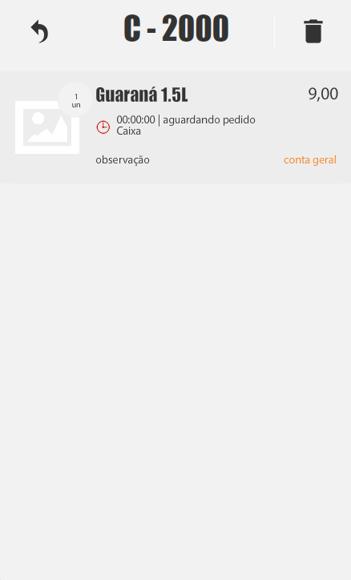

# Como cancelar item no PDV

Este tutorial explica como cancelar um item no PDV antes de finalizar o pedido.

## Objetivo

Ensinar o usuario a cancelar um item no PDV antes de finalizar o pedido.

## Quando utilizar

Use este procedimento quando for necessario remover um item de um pedido que ainda nao foi finalizado no PDV.

## Antes de comecar

- Acesse o pedido no qual o item sera cancelado.

## Passo a passo

### 1. Abrir o PDV

Acesse o PDV para localizar o pedido que sera ajustado.

### 2. Localizar o pedido pelo numero

Encontre o pedido pelo numero informado antes de fazer a alteracao.

Confirme se voce abriu o pedido correto antes de continuar.

### 3. Acessar o pedido e cancelar o item

Abra o pedido localizado e use a opcao de cancelamento para remover o item desejado.

Se houver mais de um item no pedido, revise qual item sera cancelado antes de concluir a acao.

Na imagem, o PDV mostra um pedido aberto com a acao de cancelamento disponivel. Use essa referencia apenas como apoio visual e confirme no sistema qual item sera removido antes de concluir a acao.

### 4. Conferir a atualizacao do pedido

Depois do cancelamento, confira se o item foi removido da lista do pedido.

## Resultado esperado

A lista do pedido deve ser atualizada sem o item cancelado.

Quando todos os itens forem removidos, o pedido deve ser excluido do sistema.

## O que acontece na operacao

O pedido permanece aberto no PDV com os itens restantes, caso ainda exista pelo menos um item no pedido.

Quando todos os itens sao removidos, o pedido deixa de existir no sistema, conforme a regra informada para este fluxo.

## Problemas comuns

### Produto nao aparece na pesquisa

Se o item nao aparecer durante a localizacao do pedido ou da lista de itens, confirme se o pedido correto foi aberto e se o produto ainda faz parte desse pedido.

Se necessario, refaca a busca antes de cancelar o item.

### Pedido nao segue para a area operacional

Verifique se existe area operacional configurada quando esse comportamento fizer parte do fluxo da loja.

Como este tutorial trata do cancelamento de item antes da finalizacao do pedido, a aplicacao exata desse comportamento precisa ser validada.

## Conteudos relacionados

- [PDV do Atendi OS](../pdv-visao-geral.md)
- [Como realizar uma venda no PDV](../realizar-venda/pdv-realizar-venda.md)
- [Central de pedidos](../../../03-gestao-de-pedidos/central-de-pedidos/central-pedidos-visao-geral.md)
- [Areas de producao](../../../07-configuracao/areas-de-producao/areas-producao-configurar.md)

## Pendencias de validacao

- Confirmar os nomes oficiais das telas, campos e botoes usados para localizar o pedido e cancelar o item.
- Confirmar se o cancelamento acontece no pedido pelo numero ou diretamente na lista de itens dentro do PDV.
- Confirmar se o problema comum `Pedido nao segue para a area operacional` realmente se aplica a este fluxo de cancelamento antes da finalizacao.
- Confirmar se existe alguma etapa adicional de confirmacao antes da exclusao automatica do pedido quando todos os itens sao removidos.
